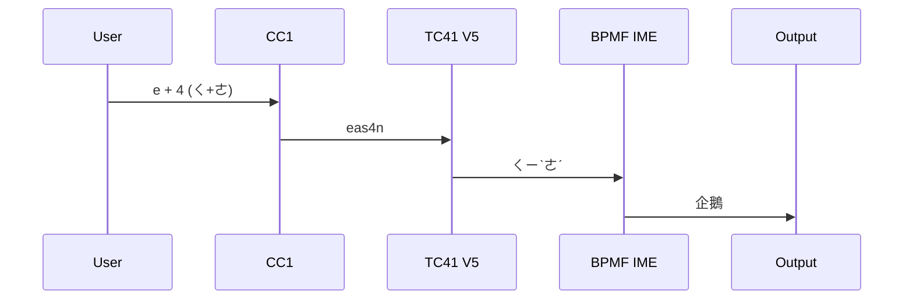
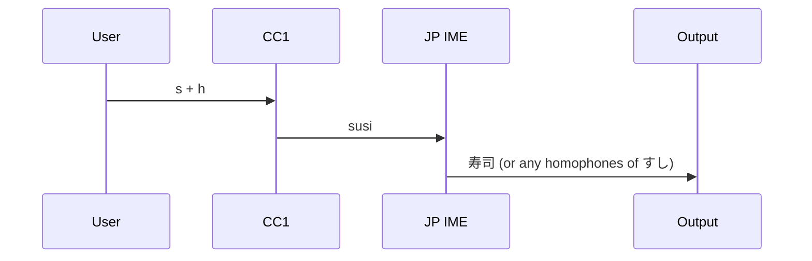

## Preface

Several types of chords can be used under the combinations of CC1 and my Bopomofo input method, and they may conflict with each other when they share the same key set. In this article, I would explain each type of chord and how I prevent the conflict between them.

## Bopomofo Chord

Since the Bopomofo of any Chinese character has at most one consonant, rhyme, and medial, one can input the consonant, rhyme, and medial of a Chinese character at the same time on a normal keyboard. (It's called 聲韻並擊 in Chinese.) And it's also possible on CC1 with my Bopomofo input method. 

All possible combinations of the Bopomofo chord can be looked up in some Chinese dictionaries, like [this Bopomofo index of a Chinese dictionary website](https://www.zdic.net/zd/zy/). It is useful when I want to add a new CC1 chord that does not conflict with Bopomofo chords.


I have [another article about Bopomofo chords](/@andy23512/rywyCLGa0).


## CC1 Chord


I list my CC1 chords in [this note](/@andy23512/BJ-I7kx0T).


### CC1 English Chord

The Bopomofo chords are possible to conflict with CC1 chords when they share the same key set. To keep the chording feature working for English and prevent conflict, I discard all built-in chords from CC1 and only add chords that do not conflict with Bopomofo chords. 

An example in , `e+x -> exit` is not a conflicting CC1 chord, because the corresponding Bopomofo symbols of `e` and `x` are `ㄑ` and `ㄡ`, and `ㄑㄡ` is not a valid Bopomofo combination.

### CC1 Chinese Chord (Under Bopomofo input method)

Keeping the chording feature of CC1 opens a new possibility, using CC1 chord to type Chinese words. I made the CC1 convert an invalid Bopomofo chord to a series of keys that type out a Chinese word.

For example, This is the `ㄑ+ㄜ -> 企鵝` chord in work. (企鵝 is penguin in Chinese.)

And this is the sequence chart of how it works.

So what I did is adding an `e + 4 -> eas4n[KSC_00]` chord in CC1. It is mapped to `ㄑ+ㄜ -> ㄑㄧˋㄜˊ[KSC_00]` under TC41 V5, and the output word `企鵝` is decided by the Bopomofo IME according to its dictionary.

(`[KSC_00]`, "No Key Pressed" action in the device manager, is used to eliminate the auto space of the CC1 chord, which would open the word selection menu and I don't want it.)

#### Limitation

There are some limitations to this kind of chord. 

Besides the conflict problems mentioned above, the tricky one is that one cannot use more than one consonant, rhyme, or medial in the chord input. For example, `ㄋ+ㄏ` cannot be used because it has two consonants (`ㄋ` and `ㄏ`) in it. Because Bopomofo IME would only keep at most one consonant, rhyme, and medial in its buffer, Backspaces generated by CC1 would be more than the symbols in the buffer and delete the previous characters.

Also, the tone keys cannot be used in this kind of chord due to a similar issue.

### CC1 Japanese Chord (Under Romaji input method)

Though I don't type a lot of Japanese, I try to make a CC1 chord for Japanese. Similar to the CC1 Chinese chords mentioned above, I set a chord which outputs a series of keys that type out a Japanese word.

For example, this is the `s+h -> すし(寿司)` chord in work. (same as CC1 Chinese chord, the trailing space need to be removed.)

And this is the sequence chart of how it works.

#### Limitation

The character reduction nature of Japanese IME would have problem with CC1's chord feature, because the number of backspace generated by CC1 may be different from the character number in the buffer and the previous characters would be deleted.

For example, chording `n+u` would types out ぬ(nu), うん(un), or 運(un). There would be randomly one or two character(s) in the buffer, depending on the key press order and the word priority decided by IME. Then CC device would generate two backspaces for the `n+u` chord. So if the output is single character, like ぬ or 運, a previous character would be removed.

So the limitation of this kind of chord is one only can choose key combinations that the pre-output characters in any order wouldn't be reduced by IME. It may be easier to choose key combinations under romaji input method. (Just don't use vowel keys in chord input.) But it would be far more complex for Kana input method since there are too many combinations of Kana that can be transformed to Kanji, so it's not recommended to use Japanese chords under Kana input method. 
