```mermaid
gantt
    title 各學習階段和它們的建議英打速度範圍
    dateFormat X
    axisFormat %s
    記憶鍵盤佈局（無需輸入裝置）: milestone, 0, 0
    練習按鍵佈局 : 0, 13
    深入練習字母: 13, 30
    練習三元組（Trigram）: 13, 23
    練習單字: 20, 40
    實際使用: milestone, 20, 20
```

## 記憶鍵盤佈局（無需輸入裝置）

- 目的：在輸入裝置不在你手邊時，比如它還沒送達時，記憶各個按鍵的位置。
- 推薦工具：
  - [我製作的預設裝置佈局的字母鍵的 Anki 牌組](https://ankiweb.net/shared/info/1396809787)
  - 使用 [Alnitak](https://andy23512.github.io/alnitak/) 的 Number, Letter 和 Symbol 課程並開啟隔空模式設定，來進行隔空打字
  - [Alnitak 的佈局記憶歌](https://andy23512.github.io/alnitak/layout-song)
- 推薦目標：
  - 你能在沒有任何圖像輔助的情況下想起每個按鍵的位置。


[Anki](https://apps.ankiweb.net/) 有個[「影像遮擋」](https://docs.ankiweb.net/editing.html?highlight=image#image-occlusion)功能。你可以下載預設的鍵盤佈局圖片（[CC1/2](https://docs.charachorder.com/_images/CCEnglish2.png) 或 [Master Forge](https://docs.charachorder.com/_images/M4-Layout.png)）後，新增「遮擋了按鍵文字」的卡片來幫你記憶它。我也製作了一個預設佈局上的字母鍵的牌組，你可以[在這邊下載到](https://ankiweb.net/shared/info/1396809787)。

隔空打字就是在沒有輸入裝置的情況下，用手指模仿打字手勢，無論是在隔空、桌子上，甚至在你的手或腿上。我開發的練習工具，[Alnitak 參宿一](https://andy23512.github.io/alnitak)，也有一個隔空模式設定。它會自動用你所設定的速度完成按鍵的訓練，讓你可以跟著它，像在真的裝置上打字一樣移動你的手指。

此外，Alnitak 上還有一首由 AI 生成的[佈局記憶歌](https://andy23512.github.io/alnitak/layout-song)。它能幫助你記住預設佈局。



## 練習按鍵佈局

- 目的：熟悉各個按鍵的位置，直到你不需要圖像輔助你找到你要的按鍵為止。
- 推薦英打速度範圍：0～13 WPM
- 推薦工具：
  - [dot i/o](https://www.iq-eq.io/#/) 的 Letters 級別
  - [CharaChorder LaunchPad](https://launchpad.charachorder.com/#/) 的 Alphabetic 級別
  - [Alnitak](https://andy23512.github.io/alnitak/) 的 Number, Letter 和 Symbol 課程
  - [Keybr](https://www.keybr.com/) 的引導、原始碼和數字課程，需搭配 Keybr CC 擴充套件（[Chrome 應用程式商店](https://chromewebstore.google.com/detail/keybr-cc-extension/fdofhfbipdhkkhhdjlfjnjfnkibpbdpg) / [Firefox 附加元件站](https://addons.mozilla.org/en-US/firefox/addon/keybr-cc-extension/)）
    - 註：建議在這裡將目標速度（Target Speed）設定改為 15。
  - [Monkeytype](https://monkeytype.com/) 的 English 字集，需搭配 Monkeytype CC 擴充套件（[Chrome 應用程式商店](https://chromewebstore.google.com/detail/mhfjhmegecimjbohhdbflkhdfnaadple) / [Firefox 附加元件站](https://addons.mozilla.org/en-US/firefox/addon/monkeytype-cc-extension/)）
- 推薦目標：
  - 在 [dot i/o](https://www.iq-eq.io/#/) 的 Letters 級別或 [CharaChorder LaunchPad](https://launchpad.charachorder.com/#/) 的 Alphabetic 級別達到 13 WPM 速度
  - 在 [Alnitak](https://andy23512.github.io/alnitak/) 的非複習課程中達到 100 連擊和 100 CPM 速度
  - [Keybr](https://www.keybr.com/) 上所有字母變為綠色
  - 在 [Monkeytype](https://monkeytype.com/) 的 English 字集達到 13 WPM 速度

CharaChorder 3D 輸入裝置，包含 CharaChorder One、CharaChorder Two 和 Master Forge，不像一般鍵盤有按鍵文字標示，因此學會盲打你將能更好的使用它們。所以首先我們要先熟悉各個按鍵的位置。

官方提供的練習工具，[dot i/o](https://www.iq-eq.io/#/) 和 [CharaChorder LaunchPad](https://launchpad.charachorder.com/#/)，上面有對應的級別可供練習。你可以跟著上面的圖像指引練習所有的英文字母。

Dot i/o 和 CharaChorder LaunchPad 上只有 CC1 和 CCL 的預覽圖。但 CC2 的預設佈局與 CC1 是一樣的。另外它們支援的按鍵，在 CC1/2 和 M4G 的預設佈局上，大多都在相同位置。因此你還是可以使用它們來練習 CC2 或 M4G。

除此之外，[Alnitak](https://andy23512.github.io/alnitak/) 是一個特別為了練習 CharaChorder 3D 輸入裝置的按鍵佈局所設計的工具。字元鍵，包含數字、字母和符號，被分成數個小課程，使使用者可以一次只專注練習一小部分的按鍵。此外，在使用者達成 20 連擊後，圖像指引會消失，之後打錯字時又會再次顯示。這可以幫助使用者真的記憶按鍵位置，而不是只單純照著圖像指引輸入。

[Keybr](https://www.keybr.com/) 沒有內建 CharaChorder 3D 輸入裝置的圖像指引，但我開發的瀏覽器擴充套件，Keybr CC Extension（[Chrome 應用程式商店](https://chromewebstore.google.com/detail/keybr-cc-extension/fdofhfbipdhkkhhdjlfjnjfnkibpbdpg) / [Firefox 附加元件站](https://addons.mozilla.org/en-US/firefox/addon/keybr-cc-extension/)），可以將其加到 Keybr 上。

如果你偏好用實際的單字來熟悉鍵盤佈局，你可以在 [Monkeytype](https://monkeytype.com/) 上，搭配 Monkeytype CC Extension（[Chrome 應用程式商店](https://chromewebstore.google.com/detail/monkeytype-cc-extension/mhfjhmegecimjbohhdbflkhdfnaadple) / [Firefox 附加元件站](https://addons.mozilla.org/en-US/firefox/addon/monkeytype-cc-extension/)）進行練習。這是我開發的另一個類似 Keybr CC Extension 的瀏覽器擴充套件。要留意的地方是 Monkeytype 上預設的 English 字集中只有一個字有字母 j，並且它沒有有字母 q、x 或 z 的字。你可能需要用其他字集或使用自訂文字來練習那些字母。


## 深入練習字母

- 目的：強化對字母按鍵的肌肉記憶
- 推薦英打速度範圍：13～30 WPM
- 推薦工具：
  - [CCIO](https://adventure.charachorder.io/) 的 Constitution Training/Test 模組
  - [Keybr](https://www.keybr.com/) 的引導課程（在沒有圖像指引下使用）
    - 註：建議將目標速度（Target Speed）設定改為 30。你也可以從更低速度開始，再依照你的學習進度漸漸增加至 30。
- 推薦目標：
  - 在 [CCIO](https://adventure.charachorder.io/) 的 Constitution Test 模組上的 Novice 級別中取得 S 或 S+ 評分
  - [Keybr](https://www.keybr.com/) 上所有字母變為綠色

[CCIO] 是官方提供的，具革命性意義的打字練習遊戲和整合平台。它的 Constitution 模組能訓練和測試你對鍵盤佈局的熟悉程度。因為它的鍵盤佈局示意圖並不會標示目前的按鍵位置，我建議是在學好上面提到的按鍵佈局之後再來使用這個模組。

此外，[Keybr](https://www.keybr.com/) 有助於使用者學習盲打。如果你已經學好上面提到的按鍵佈局，你可以用 Keybr 來進而強化對字母按鍵的肌肉記憶。它預設的目標速度為 35 WPM，但使用者可能要花上數星期來解鎖第七個字母，並花上數個月完成所有字母，所以這邊是建議使用 30。如果還是覺得太困難，你可以從較低的目標速度開始，再依你的學習進度漸漸增加。


## 練習三元組（Trigram）

- 目的：練習常用的字母組合
- 推薦英打速度範圍：13～27 WPM
- 推薦工具：
  - [dot i/o](https://www.iq-eq.io/#/) 的 Trigram 級別
  - [CharaChorder LaunchPad](https://launchpad.charachorder.com/#/) 的 Amalgamate 級別
- 推薦目標：
  - 達到 27 WPM 速度

官方提供的練習工具，[dot i/o](https://www.iq-eq.io/#/) 和 [CharaChorder LaunchPad](https://launchpad.charachorder.com/#/)，上面有對應的級別可供練習三元組。練習這些三元組將有助於加快你的英打速度。因為很多英文單字中會包含這些三元組。


## 練習單字

- 目的：練習常用單字
- 推薦英打速度範圍：20～40 WPM
- 推薦工具：
  - [CCIO](https://adventure.charachorder.io/) 的 Dexterity Training/Test 模組
  - [dot i/o](https://www.iq-eq.io/#/) 的 Words 級別
  - [CharaChorder LaunchPad](https://launchpad.charachorder.com/#/) 的 Lexical 級別
  - [Monkeytype](https://monkeytype.com/) 的 English 字集
- 建議目標：
  - 在 [CCIO](https://adventure.charachorder.io/) 的 Dexterity Test 模組上的 Medium 級別取得 S 或 S+ 評分
  - 在 [dot i/o](https://www.iq-eq.io/#/) 和 [CharaChorder LaunchPad](https://launchpad.charachorder.com/#/) 上的對應的級別達到 40 WPM 速度
  - 在 [Monkeytype](https://monkeytype.com/) 的 English 字集達到 40 WPM 速度

官方提供的練習工具，[CCIO](https://adventure.charachorder.io/)、[dot i/o](https://www.iq-eq.io/#/) 和 [CharaChorder LaunchPad](https://launchpad.charachorder.com/#/)，上面有對應的級別或模組可供練習常用英文單字。

[Monkeytype](https://monkeytype.com/) 是一個熱門的短時打字練習和速度測試工具。


## 實際使用

- 目的：
  - 實際在你的使用情境下，熟悉使用這個輸入裝置
  - 調整裝置的鍵盤佈局和設定，來配合你的使用情境
- 推薦英打速度範圍：20 WPM 以上

實際使用 CharaChorder 3D 輸入裝置是很重要的。你可以試著用它們處理一些小事情。

舉例來說，你可以寫個小文章或小程式，或做其他會用鍵盤的事情。這過程你可能會發現一些你想調整的按鍵位置或設定。

