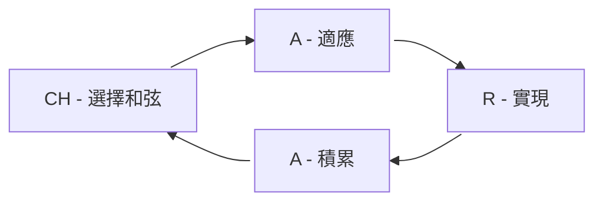

# 零、前置準備

### 和弦輸入是什麼？

和弦輸入，是一種你能透過同時按下多個按鍵來輸出文字、數字或指令的文字輸入方式。與在鋼琴上彈奏和弦時類似。

舉例來說，底下是一個在 CharaChorder 輸入裝置上的一個和弦。我同時按下 h 和 w 鍵後再同時放開，裝置就會幫我輸入 "Hello, World!"。




仔細觀察可以看到，在 `Hello, World` 被打出來之前，我同時按下後同時放開的兩個鍵，`h` 和`w` 鍵，有被打出來後再被刪掉。同時按下再放開的多個鍵，即這個範例中的 `h` 和`w` 鍵，我們稱為「和弦輸入」。和弦最終打出的字，即這個範例中的 `Hello, World!`，則被稱為「和弦輸出」。這個和弦可以寫為 `h+w = Hello, World!`

### 我應該在何時開始學習和弦輸入？

什麼時候應該開始學習和弦輸入沒有嚴格規定。一般而言，我會建議使用者在他們逐字輸入達到 40 WPM 時，即平均打字速度時，開始學習和弦輸入。但如果你的目標就是完全使用和弦輸入打字，你可以更早開始，像是當你記住你的佈局上的每個鍵的位置之後。

### 我應該設定一些目標嗎？

沒有目標的話，會很容易在學習過程中迷失方向。我會建議你在學習前和過程中弄清楚你想達到的成果。這會幫助你決定你的和弦庫的內容和規劃練習環境。

它們可以是一些打字速度上的目標，像是在 Monkeytype 上的一個特定字集（英文 200 字 / 1000 字 / ...）中達到目標速度（60 / 100 / 150 / 250 WPM），特別是想取得 CharaChorder Discord 伺服器上的特殊身分的使用者。對於這種目標，你可以想像到你的和弦庫需要能涵蓋目標字集，你的練習也會比較偏向追求速度。

在另一方面，也可以是你想只使用和弦來在你的使用情境下，輸入一些難打的字。像這方面的目標，你的和弦庫就會傾向包含那些特殊的字，而不是一般的常用單字。跟上面比起來，練習也可以比較輕鬆一些。

## 一、建立和弦庫

### 我應該用哪個和弦庫，或者是否應該建立自己的？

我會建議你從頭開始決定你的和弦庫的每一個和弦。因為和弦輸入是你決定的，你會相對比較有印象。沒錯，甚至決定和弦輸入也是學習的過程中的一部分。

然而，如果你不想全部都要自己決定，你也找到適合你的需求的現有和弦庫的話，那你也可以從那邊開始。

### 我應該如何新增和弦？

決定和弦是一個大哉問，並且因為個體差異，每個使用者適合的方式可能很難定義。然而，我將在下面提供一些粗淺的規則和建議。

#### 決定和弦輸入的規則

當要為一個字或者片語設定和弦時，第一個問題可能會是它的和弦輸入要怎樣設定。

這邊有兩個極端規則。一個是只從和弦輸出選擇按鍵，另一個則是選擇按鍵時完全不考慮和弦輸出。為了方便說明，我把前者稱為「有調規則」、後者稱為「無調規則」。

##### 有調規則

舉我的和弦庫中的 `a+n+o = annotation` 為例。我從輸出中取出一些字元作為輸入。我通常會取第一個字元和其他地方的一些字元。 

這樣的規則，會在建立肌肉記憶之前，使你比較容易從輸出回想到其輸入。然而，在你追加更多和弦到和弦庫中後，你會開始發現它們之間的衝突，並會需要權衡或著追加額外的無關按鍵。

##### 無調規則

另一方面，避免衝突的終極解法就是讓和弦輸入與輸出彼此獨立。像是就找到一個沒被使用過的和弦輸入配給一個字，完全不考慮字裡面的字元。

這種方式就不會發生衝突，也可以有效使用各種可能的組合。然而，對使用這種規則的和弦庫，你會相對需要花多一點時間建立肌肉記憶。

#### 我的建議

##### 常用字優先

我建議是盡可能優先對較常用的字建立和弦，這樣它們可以先佔用比較好或比較短的和弦輸入。

##### 有調優先

考量到學習的難度，我建議都先嘗試用有調規則來選擇和弦輸入。如你找不到任何可用的和弦輸入，就再加一些無關聯的鍵進去，即有調與無調的混合使用。

##### 保留學過的和弦

如果你對一個和弦已經有很好的肌肉記憶，我建議在它與新和弦衝突時，不要改變它，而是對新的和弦選擇其他和弦輸入。

## 二、學習和弦

### 我應該如何學習和弦？

在逐字輸入時，你學完所有字母鍵就能打出幾乎所有單字。但和弦輸入不同，你用和弦輸入打的單字或片語的數量會更多，且會持續增加。

因為學習和弦的過程並沒有一個確定的終點，我提出一個稱為「CHARA」的學習循環，來一次只熟悉少許的和弦。

根據這個學習循環，我也開發了一個同名的和弦練習工具。你可以前往[該練習工具](https://andy23512.github.io/chara/)或<a href="">有關該工具的文章</a>查看詳細資訊。

### CHARA 循環是什麼？

CHARA 由 CHoose CHords（選擇和弦）、Adapt（適應）, Realize（實現）、Accumulate（積累）這四個階段組成。

1. CH - 選擇和弦：選擇要在這個循環學習的少許（3 到 5 個）和弦。
2. A - 適應：在有圖像輔助或文字筆記的協助下，熟悉那些和弦。
3. R - 實現：只在有需要時使用輔助的情況下，練習那些和弦。（當你真的忘記一個字的和弦輸入時，你可以看一眼輔助資訊。）
4. A - 積累：練習你目前為止學過的所有和弦。

接著，我會詳細說明每個階段。

#### CH - 選擇和弦

在循環中的第一階段是選擇 3 到 5 個和弦進來這個循環。我會建議從你的和弦庫中最常用的字開始。你可以利用 [Google 的前 20000 個英文單字清單](https://github.com/first20hours/google-10000-english/blob/master/20k.txt) 或 [Monkeytype 的前 1000 個英文單字清單](https://github.com/monkeytypegame/monkeytype/blob/master/frontend/static/languages/english_1k.json) 來比較單字頻率。

我同時建議你用一個試算表來紀錄你選了哪些和弦。在你要產生練習字集或追蹤你的學習過程時很有幫助。

#### A - 適應

對你在前一階段所選的和弦，用你喜歡的方式去準備一些小抄，上面紀錄這些和弦的輸入和輸出。它可以是真實或虛擬的便利貼，或者是有圖像輔助的和弦練習應用程式。

在打字或和弦練習應用程式中練習使用它們。這階段主要專注在正確的使用出那些和弦，並熟悉每個和弦的指法。

建議的目標速度是每分鐘打 30 個和弦（30 ChPM）。（>= 30 WPM）

#### R - 實現

接著，我們要開始脫離輔助。

對通過上一個階段的和弦，把小抄或輔助放在你可以拿到的地方，但你只能在你真的忘記一個字的和弦輸入時才能看一眼。

跟上面一樣，在打字或和弦練習應用程式中練習它們。但是，這階段則專注在記憶和弦輸出和手指動作之間的連結。就是「要打出這個字，我的手指要怎樣移動。」

建議的目標速度是 50 ChPM。(>= 50 WPM)

#### A - 積累

積累階段是每個學過的和弦最終會到的階段。這可以看作是複習階段。

你可以不用每個循環都進到這個階段進行練習，可以在你實現了大約 15 個新和弦時進行。

簡單來說，就是在打字或和弦練習應用程式練習你至今學過的所有和弦。如果你的目標是有關打字速度，你也可以在 Monkeytype 上測試。

另外，在這個階段，重點可以著重在預看並計畫下一或二個動作，即比起一個一個和弦獨立動作，嘗試連起多個和弦的動作。

你可能會發現一些你還相對不熟悉的和弦，你可以蒐集起來對它們做集中訓練。

建議的目標速度是 60 ChPM。(>= 60 WPM) 可以再根據你的目標調得更高。
