# 前言

這份筆記收集了很多有關 CharaChorder 的秘訣。大部分是收集自 CharaChorder Discord 伺服器。

## 事前準備

### 在等待你的輸入裝置送達前能做的事情

你可以參考<a href="#記憶鍵盤佈局（無需輸入裝置）">我關於學習英打逐字輸入的文章中的「記憶鍵盤佈局（無需輸入裝置）」章節</a>。

### CC1/2 的使用姿勢

關於在 CC1 和 CC2 上建議的使用姿勢，你可以參考[這支影片](https://www.youtube.com/watch?v=GXvsBoK55B8&feature=youtu.be)。

## 按鍵

### 搜尋某個按鍵的位置 

你可以用我開發的 [Alnitak 參宿一上的佈局檢視器](https://andy23512.github.io/alnitak/layout-viewer)來搜尋按鍵。點擊右上角的放大鏡按鈕，輸入按鍵名稱或者字元後，點選其中一個搜尋結果。佈局檢視器會在佈局圖上點亮那個按鍵。

佈局檢視器預設是顯示 CC1/CC2 上的預設佈局。如果你是用 Master Forge，你可以在設定頁面中變更佈局設定。

### 符號鍵

一些符號可能比較難打出來，因為你需要按住 Num-Shift 和 Shift 鍵。你可以將這些鍵改到比較容易打的位置。舉例來說，你可以把數字層的半邊的數字鍵改成對應的符號鍵。

### 換層、鎖層、層輪替鍵

每個層有其對應的層動作。你可以將這些動作設定在任何鍵上，以在不同層之間切換。它們經常以帶圓圈的數字來表示，如 ①、②、③。

根據你在其他層上的同一位置設定的動作，這個鍵的行為會有所不同。

#### 換層鍵

```mermaid
---
displayMode: compact
---
gantt
    dateFormat X
    axisFormat %s
    tickInterval 1day
    title 換層鍵 ( A1: ② | A2: ② )
    section ㅤ
    按下: milestone, done, 1, 1
    放開: milestone, done, 2, 2
    按下: milestone, done, 3, 3
    放開: milestone, done, 4, 4
    section ㅤㅤ
    A1: 0, 1s
    A2: active, 1, 1s
    A1: 2, 1s
    A2: active, 3, 1s
    A1: 4, 1s
```

第一種是換層鍵。舉例來說，A1 和 A2 層上的這個鍵的設定動作都是 A2 層，即 ②。

在預設佈局上的就是這種。它們的行為類似標準鍵盤上的換檔（Shift）鍵。當你按下它時，裝置會切換到目標層，放開時就會回到主要層。

#### 單向鎖層鍵

```mermaid
---
displayMode: compact
---
gantt
    dateFormat X
    axisFormat %s
    title 單向鎖層鍵 ( A1: ② | A2: 除了層動作以外的任何動作 )
    section ㅤ
    按下: milestone, done, 1, 1
    放開: milestone, done, 2, 2
    按下: milestone, done, 3, 3
    放開: milestone, done, 4, 4
    tickInterval 1day
    section ㅤㅤ
    A1: 0, 1
    A2: active, 1, 5
```

第二種是單向鎖層鍵。舉例來說，這個鍵在 A1 上的動作為 ②，但在 A2 上是層動作以外的任何動作。

這種鍵的行為像是標準鍵盤上的大寫鎖定（Caps Lock）鍵，但是只有單向。當你按下它時，裝置會切換到目標層，但放開或者再次按下它時，並不會切換層。

#### 雙向鎖層鍵

```mermaid
---
displayMode: compact
---
gantt
    dateFormat X
    axisFormat %s
    title 雙向鎖層鍵 ( A1: ② | A2: ① )
    section ㅤ
    按下: milestone, done, 1, 1
    放開: milestone, done, 2, 2
    按下: milestone, done, 3, 3
    放開: milestone, done, 4, 4
    tickInterval 1day
    section ㅤㅤ
    A1: 0, 1s
    A2: active, 1, 2s
    A1: 3, 2s
```

最後一種是雙向鎖層鍵。舉例來說，這個鍵在 A1 上的動作為 ②、在 A2 上的動作為 ①。

這種鍵的行為像是標準鍵盤上的大寫鎖定（Caps Lock）鍵。當你按下它時，裝置會切換到目標層，再次按下它時，會切回主要層。

#### 層輪替鍵

```mermaid
---
displayMode: compact
---
gantt
    dateFormat X
    axisFormat %s
    title 層輪替鍵 ( A1: ② | A2: ③ | A3: ① )
    section ㅤ
    按下: milestone, done, 1, 1
    放開: milestone, done, 2, 2
    按下: milestone, done, 3, 3
    放開: milestone, done, 4, 4
    按下: milestone, done, 5, 5
    放開: milestone, done, 6, 6
    tickInterval 1day
    section ㅤㅤ
    A1: 0, 1s
    A2: active, 1, 2s
    A3: crit, 3, 2s
    A1: 5, 2s
```

第四種是層輪替鍵：能將裝置切換到下一層或上一層的鍵。舉例來說，這個鍵在 A1 上的動作為 ②、在 A2 上的動作為 ③、在 A3 上的動作為 ① 。用這樣的設定，你可以只用這個鍵循環切換所有的層。

### 實用的快捷鍵

這邊有一些在打字時實用的快捷鍵。

||Windows|Mac|
|-|-|-|
|將游標移到前一個英文單字|ctrl + :arrow_left:|option + :arrow_left:|
|將游標移到下一個英文單字|ctrl + :arrow_right:|option + :arrow_right:|
|將游標移到這一行的最前面|home|cmd + :arrow_left:|
|將游標移到這一行的最後面|end|cmd + :arrow_right:|
|刪除在游標左邊的英文單字|ctrl + backspace|option + backspace|
|刪除在這一行，在游標位置之前的所有字元||cmd + backspace|

## 逐字輸入

### 學習

你可以參考<a href="">我關於學習英打逐字輸入的文章</a>。

### 交替使用空白鍵

在 CC 3D 輸入裝置的預設佈局上，有兩個空白鍵。一些使用者會交替使用它們來提升打字速度。更多細節可以參考[這個舊 Wiki 頁面中的 "Tech: Using both space keys" 章節](https://charachorder.notion.site/Typing-Exercises-a5adbdac10024675820be9f6c74a4994#:~:text=Tech%3A%20Using%20both%20space%20keys)

### 避免重複字元問題 

當你遇到不預期的重複字元問題時，可以試著在打字時只輕彈每個鍵，來避免按鍵被按壓的時間過長的問題。如果問題還是存在，可以考慮調高[「按壓和放開按鍵的防抖時間設定」](https://docs.charachorder.com/Device%20Manager.html#character-entry)

## 和弦輸入 

### KSC_00

當一個和弦的輸出有 "KSC_00 - No key pressed" 這個操作時，CC 裝置將不會自動在這個和弦的輸出的結尾加上空白字元。所以加上這個和弦可以避免這些自動空白字元在一些情況下造成的問題，比如在使用輸入法時。

### 輸入為兩個字母的和弦

輸入為兩個字母的和弦，特別是那兩個字母剛好是常用的二元組時，會很容易在你逐字輸入時誤觸。很多使用者都建議避免。

### 功能性和弦

CC 裝置中有一些你可以用的功能和弦。這些和弦不在內建的和弦庫中，但你可以[從裝置管理工具的 Library 分頁中載入它們](https://docs.charachorder.com/Device%20Manager.html#library)。

功能性和弦包含：

- 重複 X 次操作：多次按下一個鍵（刪除、退位或方向鍵）
- 游標瞬移：打出一對符號（例如括號）後，將游標移到它們中間
- Caps Lock
- 退位一個字元，接著打出 `!` 或 `: ` 後，再打出一個空白字元

### 當和弦太難時可以試的方式

當你發現一個和弦對你來說太困難時，這邊是一些你可以試的方法：

1. 使用[和弦時間診斷工具](https://typing-tech.github.io/CharaChorder-utilities/#/chord-tools?tab=3)來檢查你的按哪一些按鍵的時間太慢，並調整你的動作，直到你可以穩定地成功使用那個和弦。
2. 使用 [Spurring](https://docs.charachorder.com/Device%20Manager.html#spurring) 模式。
3. 當你覺得一個和弦的按鍵組合對你的手來說太困難，你可以對一樣的輸出，[新增一個較簡單的和弦](https://docs.charachorder.com/Chords.html#how-do-i-make-chords)。舉例來說，你可以把其中的一個鍵替換成跟它位置對稱的鍵，比如把 c 鍵換成 d 鍵。
4. 當你對很多和弦都有使用上的困難時，你可以嘗試調高[按壓和放開的容許時間](https://docs.charachorder.com/Device%20Manager.html#chording)。

### 避免在使用和弦時會刪除一些前面的字元的問題

不預期的字元刪除問題會在逐字輸入和和弦輸入的間隔時間太短的時候。這會使 CC 裝置誤將前面打的字視為失敗的和弦輸入嘗試，而產生比預期更多的退位鍵擊。

特別是當你在 Vim 中進入輸入模式後立刻就使用和弦的時候會發生。

有一些方法可以避免：

- ~~在使用和弦前按下 Ctrl 鍵。~~ （註：此替代辦法在 3.0.0-gamma.4 附近的版本已無法作用。）
- 將[自動修正設定](https://docs.charachorder.com/Device%20Manager.html#autocorrect)的最多嘗試次數設為 0。

### 對角按壓（和弦的輸入有多個按鍵在同一個搖桿上）

關於對角按壓的操作說明，可以參考[這個影片](https://youtu.be/H5aES55JRUs?si=QWr5mEJtPYtVp1KC)。如果你試過仍然覺得很困難，你可以修改和弦的輸入。舉例來說，你可以把其中的一個鍵替換成跟它位置對稱的鍵，比如把 c 鍵換成 d 鍵。

### 避免和弦衝突

在 CC 裝置上同時不能有兩個和弦有一樣的輸入。對一些有相同字母集合的單字，如 `art`、`tar` 和 `rat`，你可以對和弦輸入添加其他的按鍵，如 `Alt`、`'` 或 `Dup` 鍵，來使它們有不同的和弦輸入。

## 滑鼠

### 改變滑鼠速度

CC 裝置有四種滑鼠速度。

1. 快滑鼠：將兩個滑鼠搖桿往同方向推
2. 中快滑鼠：按住 Num-shift 鍵下，將兩個滑鼠搖桿往同方向推
3. 慢滑鼠：將一個滑鼠搖桿往任一個方向推
4. 極慢滑鼠：按住 Num-shift 鍵下，將一個滑鼠搖桿往任一個方向推

你可以在[裝置管理工具](https://docs.charachorder.com/Device%20Manager.html#mouse)或 [GTM](https://docs.charachorder.com/GenerativeTextMenu.html#mouse) 上變更滑鼠速度。

## 其他

### Mac 的辨識鍵盤對話框

當第一次把你的 CC 裝置連到 Mac 電腦上時，Mac 會嘗試辨識你的鍵盤類型。它會彈出一個對話框，要你按下空白鍵旁的 Shift 鍵等。你可以直接關掉這個對話框，CC 裝置應能正常運作。

### 使用其他語言或佈局

如果你想在 QWERTY-US 以外的其他作業系統鍵盤佈局下用 CC 3D 輸入裝置，或是用它來輸入英文以外的語言，你可以參考<a href="">我寫的相關文章</a>。

我也有開發了一個[佈局檢視器](https://andy23512.github.io/alnitak/layout-viewer)來檢視 CC 3D  輸入裝置在不同作業系統鍵盤佈局下的最終輸出字元。它預設是顯示 CC1 / CC2 上的預設佈局，你可以在設定頁面改成 Master Forge (M4G) 的預設佈局。

## 其他網站上的秘訣清單

### 影片

- [ChorderClub Essentials - YouTube](https://www.youtube.com/playlist?list=PL5UG1PKtBJF7JQxwee2AwmUA2137eMHXL)
- [CharaChorder Beginner Tips - YouTube](https://www.youtube.com/watch?v=ZJAXwuhwROI)

### 文件

- [CharaChorder One Wiki](https://charachorder.notion.site/CharaChorder-One-Wiki-f6f24cdfa4f94df7988d48e9b69fbacc)
  - "Learn to Type" 和 "Learn to Chord" 這兩個章節很有用。
- [CharaChorder Builder](https://docs.google.com/spreadsheets/d/1ZiVmLQewM9AFnHXMyyWmq5UpMn3w8RCFe9kPOmYsC4Y/edit?gid=582376771#gid=582376771)
- [裝置管理工具上的秘訣清單](https://github.com/CharaChorder/DeviceManager/blob/master/src/lib/assets/random-tips/en.json)
- [CharaChorder 官方文件上的 "Designing the layout" 章節](https://docs.charachorder.com/Layout.html#design-of-the-layout)

